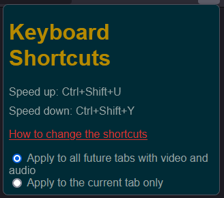

## FirefoxExtensionForSpeedingUpAllHTML5VideoAndAudio

 
  
  

It speeds ALL html5 videos AND audio (even when it's only audio, without video).

This is useful, as many players otherwise either limit you up to how many times you can speed up a video (for example, YouTube, up to only x2, which on cooking videos, or when you get used to x2 speed, can be too little) or they don't provide ability to speed up at all.

As it was designed for my use only, for now, the hardcoded shortcuts to speed up is <em>Ctrl+Shift+U</em> and <em>Ctrl+Shift+Y</em> to speed down. I might provide an interface to user select the shortcuts, or you could just change the code to suit your needs.

The orginal extension pre-forking was video_speed_up-1.5.3-an+fx.xpi but the author didn't upload it to github. I found it on mozilla's default addon page.
I had to extract it and modify it from there.
I modified it to my needs - removed floating menus, and added keyboard short cuts and so on.
